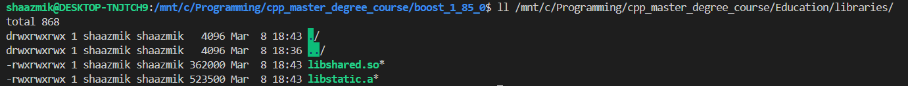
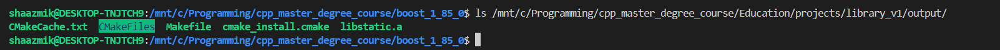
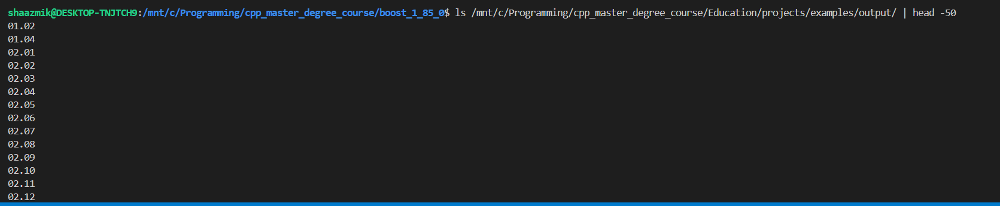

# Задание 06.04 — Автоматизированная сборка Education

Репозиторий Education подключён как git-субмодуль:

```bash
git submodule add https://github.com/i-s-m-mipt/Education.git Education
```

## Установка зависимостей

Инструменты сборки и TBB через apt:

```bash
sudo add-apt-repository ppa:ubuntu-toolchain-r/test
sudo apt update
sudo apt install g++-14 cmake git libtbb-dev
sudo update-alternatives --install /usr/bin/g++ g++ /usr/bin/g++-14 100
```

Boost 1.85 собран вручную из исходников:

```bash
wget -O boost_1_85_0.tar.gz <sourceforge url>
tar xvf boost_1_85_0.tar.gz && cd boost_1_85_0
./bootstrap.sh
sudo ./b2 toolset=gcc variant=release link=static runtime-link=static threading=multi -j$(nproc) install
```

GTest и Google Benchmark собраны из исходников и установлены через `sudo cmake --install`.

## Изменения в CMakeLists.txt

Закомментированы `find_package` и targets для библиотек, не входящих в задание:
`glog`, `Python`, `ICU`, `nlohmann_json`, `PDFHummus`, `zipper`, `libpqxx`.

Дополнительно закомментированы:
- `02.37` — требует 32-битный тулчейн (`-m32`)
- `13.19` — использует `nlohmann/json.hpp` напрямую

Исправлен путь к `libatomic.a`: `/13/` → `/14/` (под g++-14).

## Сборка

```bash
cd Education

# library_v1
cd projects/library_v1 && mkdir -p output && cd output
cmake -DCMAKE_CXX_COMPILER=g++ .. && cmake --build .
cp libstatic.a ../../../libraries

# library_v2
cd projects/library_v2 && mkdir -p output && cd output
cmake -DCMAKE_CXX_COMPILER=g++ .. && cmake --build .
cp libshared.so ../../../libraries

# examples
cd projects/examples && mkdir -p output && cd output
cmake -DCMAKE_CXX_COMPILER=g++ .. && cmake --build . -j$(nproc)
```

Собрано 394 исполняемых файла.

## Результаты

## Директория `libraries/`



## Директория `library_v1/output/`



## Директория `library_v2/output/`


## Директория `examples/output/`

